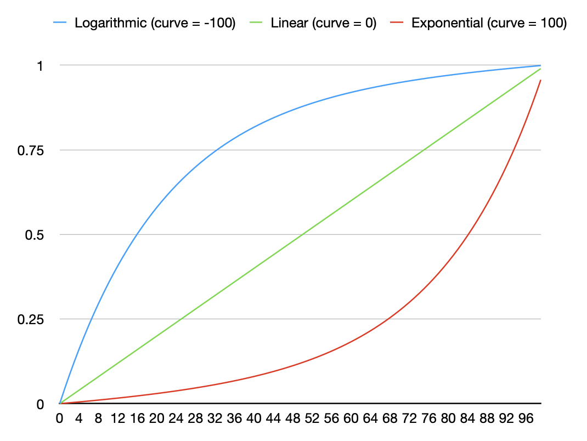

The &lt;groups&gt; element (required)
===============================

In this section, we'll find elements that pertain to samples and sample-mapping.

Every **dspreset** file should have one and only one `<groups>` element. This is where you specify the samples that make up your sample library. This element lives right underneath the top-level `<DecentSampler>` element. The basic structure is this:

```xml    
<DecentSampler>
    <groups>
        <group>
            <sample /> <!-- This is where -->
            <sample /> <!-- the samples   -->
            <sample /> <!-- get defined   -->
        </group>
    </groups>
</DecentSampler>
```

| Attribute          |            | Description       |
|--------------------|------------| ------------------|
| **`volume`**       | (optional) | The volume of the instrument as a whole. This will be reflected in the UI in the top-right corner. Value can be in linear 0.0-1.0 or in decibels. If it's in decibels you must append dB after the value (example: "3dB"). Default: 1.0 (no volume change)  |
| **`globalTuning`** | (optional) | Global pitch adjustment for changing note pitch. In semitones. For example 1.0 would be a half-step up. Default: 0 |
| **`glideTime`** | (optional) | The glide/portamento time in seconds. A value of 0.0 would mean no portamento. This value can also be set at the `<group>` and `<sample>` levels, although most people will want to set it globally at the `<groups>` level. Default: 0.0 |
| **`glideMode`** | (optional) | Controls the glide/portamento behavior. Possible values are: `always` (glide is always performed), `legato` (glide is performed only when transitioning from one note to another),  and `off`. This value can also be set at the `<group>` and `<sample>` levels, although most people will want to set it globally at the `<groups>` level. Default: `legato` |

## The &lt;group&gt; element
Samples and oscillators live in groups. There can be many group elements under the `<groups>` element. It can be useful to sort your samples into groups in order to apply similar settings to them or to control them with a knob. Each group can contain `<sample>` elements, an `<oscillator>` element, or both together. The order of groups in a file matters insofar as bindings will often reference groups by using an index. The first group in a file is group 0, the second is group 1, etc.

| Attribute         | Description                                                                                                                                                                                                                                                                                                                                        |            |
|:------------------|:---------------------------------------------------------------------------------------------------------------------------------------------------------------------------------------------------------------------------------------------------------------------------------------------------------------------------------------------------|:-----------|
| **`enabled`**     | Whether or not this group is enabled. Possible values: true, false. Default: true                                                                                                                                                                                                                                                                  | (optional) |
| **`volume`**      | The volume of the group. Value can be in linear 0.0-1.0 or in decibels. If it's in decibels you must append dB after the value (example: "3dB"). Default: 1.0                                                                                                                                                                                      | (optional) |
| **`ampVelTrack`** | The degree to which the velocity of the incoming notes affects the volume of the samples in this group. 0 = not at all. 1 = volume is completely determined by incoming velocity. When the value is 1, a velocity of 127 (max velocity) yields a gain 1.0 (full volume), a velocity of 63 (half velocity) yields a gain of 0.5 (half volume), etc. | (optional) |
| **`groupTuning`** | Group-level pitch adjustment for changing note pitch. In semitones. For example 1.0 would be a half-step up and -1 would a half-step down. Default: 0                                                                                                                                                                                              | (optional) |
| **`pitchKeyTrack`** | A number from 0.0 to 1.0. 0 means that the pitch will stay the same regardless of what note is played. 1 means that the pitch will increase by one semitone when the note increases by one semitone (normal key pitch tracking). Applies to all samples and oscillators in the group. Default: 1 | (optional) |
| **`glideTime`** | The glide/portamento time in seconds for samples and oscillators in this group. A value of 0.0 means no portamento. Can be overridden at the \`<sample>\` level. Inherits from \`<groups>\` level if not specified. Default: 0.0 | (optional) |
| **`glideMode`** | Controls the glide/portamento behavior for samples and oscillators in this group. Possible values: \`always\` (glide is always performed), \`legato\` (glide only when transitioning from one note to another), \`off\` (no glide). Inherits from \`<groups>\` level if not specified. Default: \`legato\` | (optional) |

### The &lt;sample&gt; element

Underneath the `<group>` elements are `<sample>` elements. Each sample corresponds to a playable "zone" of your instrument. Attributes:

| Attribute                   |            | Description       |
|-----------------------------|------------| ------------------|
| **`path`**                  | (required) | The relative path of the sample file to play for this zone.  |
| **`rootNote`**              | (required) | The MIDI note number (from 1 to 127) of the note. |
| **`loNote`**                | (optional) | The MIDI note number (from 1 to 127) of the lowest note for which the zone should be triggered. Default: 0. |
| **`hiNote`**                | (optional) | The MIDI note number (from 1 to 127) of the highest note for which the zone should be triggered. Default: 127. |
| **`loVel`**                 | (optional) | The lowest velocity for which this zone should be triggered. Default: 0 |
| **`hiVel`**                 | (optional) | The highest velocity for which this zone should be triggered. Default: 127 |
| **`loCCN`** **`hiCCN`** | (optional) | Using these parameter, you can use MIDI continuous controllers to filter whether or not a note should be played. This lets you, for example, have one set of samples that get played when the piano sustain pedal is down and another set that get played when it is up. Each time a MIDI CC value comes for a specific CC#, the engine stores that value. When a "note on" signal is received, the engine makes a decision (based on the last received value and the range defined by these attributes) about whether or not this sample should be played. If you use `loCCN`, you must also use a corresponding `hiCCN` for the same MIDI CC number so that you are defining a range of values. Example: `loCC64="90"` and `hiCC64="127"` would mean that a "note on" message will only trigger this sample if the last received value for CC64 (Sustain Pedal) is between 90 and 127. This can also be set at the `<group>` level. Default:-1 (off) |
| **`start`**                 | (optional) | The frame/sample position of the start of the sample audio. This is useful if the sample starts midway through the audio file. Default: 0 |
| **`end`**                   | (optional) | The frame/sample position of the end of the sample audio. The is useful is the zone ends before the end of the audio file. Default: the file's length in samples minus 1. |
| **`tuning`**                | (optional) | A fine-tuning number (in semitones) for changing the note pitch. e.g 1.0 would be a half-step up. Default: 0 |
| **`volume`**                | (optional) | The volume of the sample. Value can be in linear 0.0-1.0 or in decibels. If it's in decibels you must append dB after the value (example: "3dB"). Default: 1.0  |
| **`pan`**                   | (optional) | A number of -100 to 100. -100 in panned all the way to the left, 100 is panned all the way to the right. This can also be set at the `<group>` or `<groups>` levels. Default: 0 |
| **`pitchKeyTrack`**         | (optional) | A number from 0.0 to 1.0. 0 means that the pitch will stay the same regardless of what note is played. 1 means that the pitch will increase by one semitone when the note increases by one semitone (i.e. normal key pitch tracking). This can also be set at the `<group>` level. Default: 1 |
| **`glideTime`** | (optional) | The glide/portamento time in seconds for this sample. A value of 0.0 means no portamento. Inherits from \`<group>\` or \`<groups>\` level if not specified. Default: 0.0 |
| **`glideMode`** | (optional) | Controls the glide/portamento behavior for this sample. Possible values: \`always\`, \`legato\`, or \`off\`. Inherits from \`<group>\` or \`<groups>\` level if not specified. Default: \`legato\` |
| **`trigger`**               | (optional) | Valid values: `attack` means a sample is played when the *note on* message is received. `release` means the sample is played when the *note off* message is received (aka a release trigger). `first` means that the sample will only be played if no other notes are playing. `legato` means that the sample will only be played if _some_ other notes are already playing. `continuous` means that the sample will always play. This can also be set at the `<group>` level. Default: `attack`. |  
| **`releaseTriggerDecay`**   | (optional) | Controls the volume decay rate for release-triggered samples based on how long the note was held. When a release trigger sample plays, its volume decreases based on the time elapsed since the note was initially pressed. The value can be specified in two formats: **Decibel format (recommended):** Append "dB" to specify decay in decibels per second. For example, `"3dB"` means the volume decreases by 3dB for each second the note was held. If you specify a positive dB value, it will be automatically converted to negative (decay direction). **Linear format:** A decimal value between 0.0 and 1.0 specifying the linear gain decay factor per second. For example, `0.3` means the volume decreases by a factor of 0.3 each second. This is useful for piano pedal-up samples and other release triggers where shorter notes should have louder release samples. This can also be set at the `<group>` or `<groups>` levels. Default: 0.0 (no decay). |
| **`tags`**                  | (optional) | A command-separated list of tags. Example: tags="rt,mic1". These are useful when controlling volumes using tags. See Appendix D. |  
| **`onLoCCN`** **`onHiCCN`** | (optional) | If you want a sample to be triggered when a MIDI CC controller message comes in, for example for piano pedal down and pedal up samples, you use these attributes to specify the range of values that should trigger the sample. If you use `onLoCCN`, you must also use a corresponding `onHiCCN` for the same MIDI CC number. Example: `onLoCC64="90"` and `onHiCC64="127"` would mean that values of CC64 (Sustain Pedal) between 90 and 127 will trigger the given sample. This can also be set at the `<group>` level. Default:-1 (off) |
| **`playbackMode`**          | (optional) | By default, the choice of playback engine is left up to the discretion of the user–they can set this in the Preferences screen. However, a sample creator can override this setting by setting the playbackMode for a specific sample, a group, or the entire instrument. Possible values are `memory`, `disk_streaming`, and `auto` (default). |
| **`delay`**                 | (optional) | A delay time before the sample starts playing. The value is a decimal number (integer or float) that specifies the delay amount. The unit of measurement is controlled by the `delayUnit` attribute. Default: 0 |
| **`delayUnit`**             | (optional) | Specifies the unit of measurement for the `delay` attribute. Valid values are: `seconds` (time-based delay), `beats` (tempo-based delay), and `samples` (sample-accurate delay). Default: `seconds` |
| **`retriggerEnabled`**      | (optional) | Enables pattern retriggering for creating repeating sample sequences. When enabled, after the initial delay sequence completes, all samples in the group will retrigger according to the retriggerInterval. This allows creating looping drum patterns and rhythmic sequences from delayed samples. This can also be set at the `<group>` or `<groups>` levels. Default: `false` |
| **`retriggerInterval`**     | (optional) | The time interval between pattern repetitions when retriggerEnabled is true. This determines how long to wait before retriggering the entire delay sequence. The unit is specified by the retriggerIntervalUnit attribute. This can also be set at the `<group>` or `<groups>` levels. Default: 4.0 |
| **`retriggerIntervalUnit`** | (optional) | Specifies the unit of measurement for the `retriggerInterval` attribute. Valid values are: `seconds` (interval in seconds), `beats` (interval in musical beats - stays synchronized with host tempo), and `samples` (interval in audio samples). This can also be set at the `<group>` or `<groups>` levels. Default: `beats` |

**Looping**

| Attribute                |            | Description       |
|--------------------------|------------| ------------------|
| **`loopStart`**          | (optional) | The frame/sample position of the start of the sample's loop. If this is not specified, but the sample is a wave file with embedded loop markers, those will be used instead. Default: 0 |
| **`loopEnd`**            | (optional) | The frame/sample position of the end of the sample's loop. If this is not specified, but the sample is a wave file with embedded loop markers, those will be used instead. Default: the file's length in samples minus 1. |
| **`loopCrossfade`**      | (optional) | When loop crossfades are used, instead of simply looping at a specific end point, a portion of the audio from before the loop point is faded in just as the audio from the end of the loop is faded out. In this way, smooth audio loops can be achieved on samples that weren't specifically prepared as looping. This parameter is used for specifying the length of the crossade region in frames/samples. This can also be set at the `<group>` level. Default: 0 (crossfades off). |
| **`loopCrossfadeMode`**  | (optional) | This parameter is used to specify the curve used for crossfading when loop crossfades are turned on. This can also be set at the `<group>` level. Value values: `linear`,  `equal_power`. Default: `equal_power`. |
| **`loopEnabled`**        | (optional) | A boolean value indicating whether or not the loop should be used. Valid values: true, false |

**Amplitude Envelope**

Each sample has its own ADSR amplitude envelope. 

| Attribute         |            | Description       |
|-------------------|------------| ------------------|
| **`ampEnvEnabled`**      | (optional) | This turns the amplitude envelope on and off. Valid values are: `false` and `true` (default).  |
| **`attack`**      | (optional) | The attack time in seconds of the amplitude envelope of this zone. This can also be set at the `<group>` or `<groups>` levels.  |
| **`decay`**       | (optional) | The decay time in seconds of the amplitude envelope of this zone.  This can also be set at the `<group>` or `<groups>` levels.  |
| **`sustain`**     | (optional) | The sustain level (0.0 - 1.0) of the amplitude envelope of this zone.  This can also be set at the `<group>` or `<groups>` levels. |
| **`release`**     | (optional) | The release time in seconds of the amplitude envelope of this zone. This can also be set at the `<group>` or `<groups>` levels. |

The curve shapes of the attack, decay, and release zones can be changed as well. All three of the of the following parameters use the same system: a value from -100 to 100 that determines the shape of the curve. **-100 is a logarithmic curve, 0 is a linear curve, and 100 is an exponential curve.**

<p align="center">

</p>

| Attribute          |            | Description                                                                                                                           | Default Value      |
|--------------------|------------| --------------------------------------------------------------------------------------------------------------------------------------|--------------------|
| **`attackCurve`**  | (optional) | A value from -100 to 100 that determines the shape of the attack curve. This can also be set at the `<group>` or `<groups>` levels.   | -100 (logarithmic) |
| **`decayCurve`**   | (optional) | A value from -100 to 100 that determines the shape of the decay curve. This can also be set at the `<group>` or `<groups>` levels.    |  100 (exponential) |
| **`releaseCurve`** | (optional) | A value from -100 to 100 that determines the shape of the release curves. This can also be set at the `<group>` or `<groups>` levels. |  100 (exponential) |

**Round Robins**

Round robins allow different samples to be played each time a zone is triggered. This is especially useful with sounds that have short attacks (such as drums), and is a great way to keep your sample libraries from sounding fake. In order for round robins to work, you must specify both a `seqMode` and a `seqPosition` for all samples. If you have several different sets of round robins with different lengths, you'll want to set the `seqLength` value as well. There are several round-robin modes:

- `round_robin`: This causes samples to be triggered sequentially according to their `seqPosition` values.
- `random`: This causes random samples to be chosen from within the group of samples. If there are more than two round robins, then the algorithm makes sure not to hit the same one twice in a row.
- `true_random`: This causes random samples to be chosen from within the group of samples.
- `always`: This just turns round robins off.

| Attribute         |            | Description                                                                                                                                                                                                                                    |
|:------------------|:-----------|:-----------------------------------------------------------------------------------------------------------------------------------------------------------------------------------------------------------------------------------------------|
| **`seqMode`**     | (optional) | Valid values are `random`, `true_random`, `round_robin`, and `always`. A value indicating the desired round robin behavior for this sample or group of samples. This can also be set at the `<group>` and `<groups>` levels. Default: `always` |
| **`seqLength`**   | (optional) | The length of the round robin queue. This can also be set at the `<group>` or `<groups>` levels. If this is left out, then the engine will try to auto-detect the length of the roudn robin sequence. Default: 0                               |
| **`seqPosition`** | (optional) | A number indicating this zone's position in the round robin queue. This can also be set at the `<group>` level. Default: 1                                                                                                                     |

**Voice-Muting / Legato**

**Looping**

| Attribute            |            | Description                                                                                                                                                                                                                                                                                                                                                                                                                                                                 |
|:---------------------|:-----------|:----------------------------------------------------------------------------------------------------------------------------------------------------------------------------------------------------------------------------------------------------------------------------------------------------------------------------------------------------------------------------------------------------------------------------------------------------------------------------|
| **`silencedByTags`** | (optional) | A command-separated list of tags. Example: tags="rt,mic1". If a sample containing one of these tags gets triggered, then this sample will be stopped. This is useful when setting up drums as it will allow you mute one hi-hat when another hi-hat plays. See Appendix D.                                                                                                                                                                                                  |
| **`silencingMode`**  | (optional) | Controls how quickly voices get silenced. `fast` = immediately; `normal` = triggers the sample's release phase. This second option, when used in conjunction with the `release` attribute, allows you to specify a longer release time. Values: `fast`, `normal`. Default: `fast`                                                                                                                                                                                           |
| **`previousNotes`**  | (optional) | Only play this sample if the previously triggered note equals one of these notes. Format: a comma-separated list of MIDI note numbers (from 1 to 127) of the note.                                                                                                                                                                                                                                                                                                          |
| **`legatoInterval`** | (optional) | This is similar to the `previousNote` attribute. This causes the engine to only play the sample if the previously triggered note is exactly this semitone distance from the previous note. For example, if the note for which this sample is being triggered is a C3 and the `legatoInterval` is set to `-2`, then the sample will only play if the previous note was a D3 because D3 minus 2 semitones equals C3. Format: This can be a positive or negative whole number. |

**Routing Audio**

My default all audio is routed to the main output. However, using the attributes below you can route audio to any of the 16 buses or directly to any one of the 16 auxiliary outputs. You can also specify the volume of the audio being sent to each output.

| Attribute         |            | Description       |
|-------------------|------------| ------------------|
| **`output1Target`** | (optional) | The first audio output for this sample. This is a string that specifies the audio output that the sample should be routed to. The available options are `MAIN_OUTPUT` (the main audio output), `NO_OUTPUT` (audio is not routed anywhere), `BUS_1` (the first bus defined in the `<buses>` element), `BUS_2` (the second bus), ..., `BUS_16` (bus 16), `AUX_STEREO_OUTPUT_1` (auxiliary output 1), `AUX_STEREO_OUTPUT_2` (auxiliary output 2), ..., `AUX_STEREO_OUTPUT_16` (auxiliary output 16). Default: `MAIN_OUTPUT` |
| **`output2Target`** | (optional) | The second audio output for this sample. This is a string that specifies the audio output that the sample should be routed to. The available options are the same as for `output1Target`. Default: `NO_OUTPUT` |
| **`output3Target`** | (optional) | The third audio output for this sample. This is a string that specifies the audio output that the sample should be routed to. The available options are the same as for `output1Target`. Default: `NO_OUTPUT` |
| **`output4Target`** | (optional) | The fourth audio output for this sample. This is a string that specifies the audio output that the sample should be routed to. The available options are the same as for `output1Target`. Default: `NO_OUTPUT` |
| **`output5Target`** | (optional) | The fifth audio output for this sample. This is a string that specifies the audio output that the sample should be routed to. The available options are the same as for `output1Target`. Default: `NO_OUTPUT` |
| **`output6Target`** | (optional) | The sixth audio output for this sample. This is a string that specifies the audio output that the sample should be routed to. The available options are the same as for `output1Target`. Default: `NO_OUTPUT` |
| **`output7Target`** | (optional) | The seventh audio output for this sample. This is a string that specifies the audio output that the sample should be routed to. The available options are the same as for `output1Target`. Default: `NO_OUTPUT` |
| **`output8Target`** | (optional) | The eighth audio output for this sample. This is a string that specifies the audio output that the sample should be routed to. The available options are the same as for `output1Target`. Default: `NO_OUTPUT` |
| **`output1Volume`** | (optional) | The volume of the audio being sent to the sample's first output. This is a floating-point number between 0.0 and 1.0, where 0.0 is silent and 1.0 is full volume. Default: 1.0 |
| **`output2Volume`** | (optional) | The volume of the audio being sent to the sample's second output. This is a floating-point number between 0.0 and 1.0, where 0.0 is silent and 1.0 is full volume. Default: 1.0 |
| **`output3Volume`** | (optional) | The volume of the audio being sent to the sample's third output. This is a floating-point number between 0.0 and 1.0, where 0.0 is silent and 1.0 is full volume. Default: 1.0 |
| **`output4Volume`** | (optional) | The volume of the audio being sent to the sample's fourth output. This is a floating-point number between 0.0 and 1.0, where 0.0 is silent and 1.0 is full volume. Default: 1.0 |
| **`output5Volume`** | (optional) | The volume of the audio being sent to the sample's fifth output. This is a floating-point number between 0.0 and 1.0, where 0.0 is silent and 1.0 is full volume. Default: 1.0 |
| **`output6Volume`** | (optional) | The volume of the audio being sent to the sample's sixth output. This is a floating-point number between 0.0 and 1.0, where 0.0 is silent and 1.0 is full volume. Default: 1.0 |
| **`output7Volume`** | (optional) | The volume of the audio being sent to the sample's seventh output. This is a floating-point number between 0.0 and 1.0, where 0.0 is silent and 1.0 is full volume. Default: 1.0 |
| **`output8Volume`** | (optional) | The volume of the audio being sent to the sample's eighth output. This is a floating-point number between 0.0 and 1.0, where 0.0 is silent and 1.0 is full volume. Default: 1.0 |

### The &lt;oscillator&gt; element

The `<oscillator>` element allows you to add synthesized waveforms to your instrument, which can be used alongside or instead of traditional audio samples. Oscillators are useful for creating sub-bass layers, adding harmonic content, or building entirely synthesized instruments within DecentSampler.

Oscillators live inside `<group>` elements, just like `<sample>` elements. Each group can contain samples, an oscillator, or both, allowing you to layer oscillators with samples within the same group or create multi-oscillator patches by using multiple groups.

**Basic Usage:**

The simplest oscillator configuration requires only a waveform type:

```xml
<group name="Sub Bass" volume="0.6" groupTuning="-12">
    <oscillator waveform="sine" />
</group>
```

This creates a sine wave oscillator tuned one octave below the played note.

**Attributes:**

The `<oscillator>` element itself has only one attribute:

| Attribute | Required/Optional | Description | Default |
|-----------|-------------------|-------------|---------|
| **\`waveform\`** | (optional) | The waveform shape. Valid values: \`sine\`, \`saw\`, \`square\`, \`triangle\`, \`noise\` (or \`white_noise\`), \`pluck1\`. | \`sine\` |
| **\`damping\`** | (optional) | **Only for \`pluck1\` waveform.** Controls the decay time of the plucked string. Range: 0.0 to 1.0. Lower values (closer to 0.0) create heavily damped, shorter sounds. Higher values (closer to 1.0) create minimal damping with longer, more resonant decay. This simulates the natural damping characteristics of string materials and playing techniques. | \`0.5\` |
| **\`pluckType\`** | (optional) | **Only for \`pluck1\` waveform.** Blends between different excitation signals to control the timbral character. Range: 0.0 to 1.0. At 0.0, the oscillator uses a smooth triangle wave excitation producing a softer, mellower tone. At 1.0, it uses a noise burst excitation producing a brighter, more aggressive attack with richer harmonics. Intermediate values blend between the two extremes. | \`0.5\` |

All other oscillator parameters are inherited from the parent `<group>` element.

**Waveform Types:**

- **\`sine\`**: A pure sine wave with no harmonics. Ideal for sub-bass and clean tones.
- **\`saw\`**: A sawtooth wave with rich harmonics. Great for bright, cutting sounds.
- **\`square\`**: A square wave with odd harmonics. Useful for hollow, reed-like tones.
- **\`triangle\`**: A triangle wave with fewer harmonics than saw. Produces a mellower tone.
- **\`noise\`** (or **\`white_noise\`**): White noise generator. Perfect for percussion textures, hi-hats, snares, wind sounds, and adding grit to other sounds.
- **\`pluck1\`**: A physical modeling oscillator based on digital waveguide synthesis that simulates plucked string behavior. Unlike traditional waveforms that cycle continuously, pluck1 generates a single excitation (like plucking a string) that decays naturally over time. Ideal for synthesizing plucked string instruments like guitar, bass, harp, koto, gayageum, and other stringed instruments. This oscillator includes two parameters for controlling the sound character: \`damping\` and \`pluckType\`.

**Group-Level Parameters:**

Oscillators inherit and respect most of the same parameters as samples when set at the `<group>` level, including:
- \`groupTuning\` - Pitch adjustment in semitones
- \`loNote\` / \`hiNote\` - Note range triggering
- \`attack\`, \`decay\`, \`sustain\`, \`release\` - ADSR envelope parameters
- \`attackCurve\`, \`decayCurve\`, \`releaseCurve\` - Envelope curve shapes
- \`volume\` - Oscillator group volume
- \`pan\` - Stereo positioning
- \`ampVelTrack\` - Velocity sensitivity
- \`pitchKeyTrack\` - Keyboard pitch tracking (0.0 to 1.0). A value of 0 means the oscillator stays at a fixed pitch regardless of which key is pressed. A value of 1 means normal keyboard tracking (default)
- \`glideTime\` - Portamento/glide time in seconds (inherited from \`<groups>\` level if not specified)
- \`glideMode\` - Portamento behavior: \`always\`, \`legato\`, or \`off\` (inherited from \`<groups>\` level if not specified)

**Modulation Support:**

Oscillators fully support modulation through bindings and modulators, just like samples:
- **GROUP_TUNING** - Modulate oscillator pitch (e.g., for vibrato LFOs)
- **GLOBAL_TUNING** - Global pitch modulation affects all oscillators
- **GROUP_VOLUME** - Modulate oscillator amplitude
- **AMP_VOLUME** - Control oscillator volume with UI controls or MIDI

Example with LFO vibrato:
```xml
<modulators>
    <lfo shape="sine" frequency="5.0" modAmount="0.15" scope="global">
        <binding type="amp" level="group" position="0" parameter="GROUP_TUNING" 
                 modBehavior="add" translation="linear" 
                 translationOutputMin="-0.5" translationOutputMax="0.5"/>
    </lfo>
</modulators>
```

**Multi-Oscillator Example:**

Here's a practical example showing how to layer multiple oscillators to create a rich synthesized sound:

```xml
<DecentSampler minVersion="1.15.0">
    <groups>
        <!-- Fundamental saw wave -->
        <group name="Fundamental" volume="0.5" attack="0.01" decay="0.3" sustain="0.7" release="0.5">
            <oscillator waveform="saw" />
        </group>
        
        <!-- Sine wave octave up for brightness -->
        <group name="Octave Up" volume="0.3" groupTuning="12" attack="0.02" decay="0.3" sustain="0.7" release="0.5">
            <oscillator waveform="sine" />
        </group>
        
        <!-- Sub bass (limited to lower notes) -->
        <group name="Sub Bass" volume="0.6" groupTuning="-12" loNote="0" hiNote="60" 
               attack="0.01" decay="0.3" sustain="0.7" release="0.8">
            <oscillator waveform="sine" />
        </group>
        
        <!-- Detuned oscillators for stereo width -->
        <group name="Detuned Left" volume="0.25" pan="-50" groupTuning="-0.1" 
               attack="0.01" decay="0.3" sustain="0.7" release="0.5">
            <oscillator waveform="saw" />
        </group>
        
        <group name="Detuned Right" volume="0.25" pan="50" groupTuning="0.1" 
               attack="0.01" decay="0.3" sustain="0.7" release="0.5">
            <oscillator waveform="saw" />
        </group>
    </groups>
    
    <effects>
        <effect type="lowpass" frequency="8000.0" resonance="1.0"/>
        <effect type="reverb" wetLevel="0.15" roomSize="0.5"/>
    </effects>
</DecentSampler>
```

**Monophonic Lead Synth with Portamento:**

Here's a complete example of a Moog-style monophonic lead synthesizer with portamento:

```xml
<DecentSampler minVersion="1.15.0">
  <ui width="812" height="375">
    <tab name="main">
      <labeled-knob x="10" y="20" width="90" label="Attack" type="float" 
                    minValue="0.0" maxValue="2.0" value="0.01">
        <binding type="amp" level="instrument" position="0" parameter="ENV_ATTACK"/>
      </labeled-knob>
      <labeled-knob x="110" y="20" width="90" label="Glide Time" type="float" 
                    minValue="0.0" maxValue="2.0" value="0.3">
        <binding type="general" level="instrument" position="0" parameter="GLIDE_TIME"/>
      </labeled-knob>
      <labeled-knob x="210" y="20" width="90" label="Cutoff" type="float" 
                    minValue="0" maxValue="22000" value="2000.0">
        <binding type="effect" level="instrument" position="0" parameter="FX_FILTER_FREQUENCY"/>
      </labeled-knob>
      <labeled-knob x="10" y="130" width="90" label="Detune" type="float" 
                    minValue="-1" maxValue="1" value="0.1">
        <binding type="amp" level="group" position="1" parameter="GROUP_TUNING"/>
      </labeled-knob>
    </tab>
  </ui>
  
  <!-- glideTime and glideMode set at groups level apply to all oscillators -->
  <groups glideTime="0.3" glideMode="legato" attack="0.01" decay="0.3" 
          sustain="0.7" release="0.5" volume="0.8">
    <!-- Two detuned saw oscillators for thickness -->
    <group name="Osc1" tags="osc1">
      <oscillator waveform="saw" />
    </group>
    <group name="Osc2" tags="osc2">
      <oscillator waveform="saw" />
    </group>
  </groups>
  
  <effects>
    <effect type="lowpass" frequency="2000.0" resonance="0.3" 
            envelope_amount="3000.0" envelope_attack="0.01" 
            envelope_decay="0.3" envelope_sustain="0.0" envelope_release="0.5"/>
  </effects>
  
  <modulators>
    <!-- LFO vibrato -->
    <lfo shape="sine" frequency="5.0" modAmount="0.15" scope="global">
      <binding type="amp" level="group" tags="osc1,osc2" parameter="GROUP_TUNING" 
               modBehavior="add" translation="linear" 
               translationOutputMin="-0.5" translationOutputMax="0.5"/>
    </lfo>
  </modulators>
  
  <!-- Use tag polyphony to enforce monophonic behavior -->
  <tags>
    <tag name="osc1" volume="1" pan="0" polyphony="1" />
    <tag name="osc2" volume="1" pan="0" polyphony="1" />
  </tags>
</DecentSampler>
```

This preset demonstrates:
- **Portamento/Glide**: Set via \`glideTime\` (0.3 seconds) and \`glideMode\` (legato - only glides between connected notes)
- **Monophonic behavior**: Achieved using tag polyphony limits (\`polyphony="1"\`)
- **Detuned oscillators**: Two saw waves with slightly different tuning for a fatter sound
- **Modulation**: LFO vibrato applied to both oscillators via GROUP_TUNING binding
- **Filter envelope**: Adds movement to the timbre

**Combining Oscillators with Samples:**

You can combine oscillators and samples within the same group or across separate groups. Here's an example mixing them in a single group to add a sub-bass layer to piano samples:

```xml
<groups>
    <!-- Piano samples with built-in sine wave sub-bass -->
    <group name="Piano with Sub" volume="1.0">
        <sample path="Samples/Piano/C3.wav" rootNote="60" loNote="59" hiNote="61" />
        <sample path="Samples/Piano/D3.wav" rootNote="62" loNote="61" hiNote="63" />
        <!-- more samples... -->
        <!-- Oscillator mixed in the same group -->
        <oscillator waveform="sine" />
    </group>
</groups>
```

Or use separate groups for independent control:

```xml
<groups>
    <!-- Sample-based piano sound -->
    <group name="Piano Samples" volume="1.0">
        <sample path="Samples/Piano/C3.wav" rootNote="60" loNote="59" hiNote="61" />
        <!-- more samples... -->
    </group>
    
    <!-- Sine wave sub-bass layer -->
    <group name="Sub Layer" volume="0.3" groupTuning="-12" hiNote="60">
        <oscillator waveform="sine" />
    </group>
</groups>
```

**Physical Modeling with pluck1:**

The \`pluck1\` waveform uses digital waveguide synthesis to simulate plucked string instruments. Unlike traditional oscillator waveforms that cycle continuously, pluck1 generates a transient excitation that decays naturally, making it ideal for realistic plucked string sounds:

```xml
<DecentSampler minVersion="1.15.0">
    <ui width="812" height="375">
        <tab name="main">
            <labeled-knob x="10" y="20" width="90" label="Damping" type="float" 
                          minValue="0.0" maxValue="1.0" value="0.5">
                <binding type="general" level="group" position="0" 
                         parameter="OSCILLATOR_DAMPING"/>
            </labeled-knob>
            <labeled-knob x="110" y="20" width="90" label="Pluck Type" type="float" 
                          minValue="0.0" maxValue="1.0" value="0.5">
                <binding type="general" level="group" position="0" 
                         parameter="OSCILLATOR_PLUCK_TYPE"/>
            </labeled-knob>
        </tab>
    </ui>
    
    <groups attack="0.001" decay="0.1" sustain="0.8" release="0.2">
        <group name="Plucked String" volume="0.8">
            <oscillator waveform="pluck1" damping="0.5" pluckType="0.5" />
        </group>
    </groups>
</DecentSampler>
```

In this example:
- **\`damping="0.5"\`**: Moderate decay time - the string sustains for a reasonable duration
- **\`pluckType="0.5"\`**: Balanced between smooth (triangle wave) and bright (noise burst) excitation
- **OSCILLATOR_DAMPING** and **OSCILLATOR_PLUCK_TYPE** binding parameters allow real-time control from the UI

The pluck1 oscillator is particularly effective for:
- **Bass guitars**: Use lower \`damping\` values (0.3-0.5) with higher \`pluckType\` (0.6-0.8) for percussive attack
- **Acoustic guitars**: Medium \`damping\` (0.5-0.7) with balanced \`pluckType\` (0.4-0.6)
- **Harps and lyres**: Higher \`damping\` (0.7-0.9) with lower \`pluckType\` (0.2-0.4) for softer, sustained tones
- **Ethnic stringed instruments**: Experiment with \`pluckType\` to match the excitation character of traditional instruments like koto, sitar, gayageum, etc.

**UI Control for Oscillators:**

You can create UI controls to switch waveforms dynamically:

```xml
<ui width="812" height="375">
    <tab name="main">
        <menu x="10" y="70" width="150" height="30" value="1">
            <option name="Sine">
                <binding type="general" level="group" position="0" 
                         parameter="OSCILLATOR_WAVEFORM" 
                         translation="fixed_value" translationValue="sine"/>
            </option>
            <option name="Saw">
                <binding type="general" level="group" position="0" 
                         parameter="OSCILLATOR_WAVEFORM" 
                         translation="fixed_value" translationValue="saw"/>
            </option>
            <option name="Square">
                <binding type="general" level="group" position="0" 
                         parameter="OSCILLATOR_WAVEFORM" 
                         translation="fixed_value" translationValue="square"/>
            </option>
        </menu>
    </tab>
</ui>
```

**Tips and Best Practices:**

1. **Layer multiple waveforms**: Combine different waveform types at different octaves for complexity.
2. **Use detuning**: Create stereo width by layering slightly detuned oscillators panned left and right.
3. **Limit note ranges**: Use \`loNote\` and \`hiNote\` to restrict certain oscillators to specific registers (e.g., sub-bass only on low notes).
4. **Add envelope variation**: Use different ADSR settings on each oscillator group for evolving textures.
5. **Monophonic leads**: Use tag polyphony (\`polyphony="1"\`) combined with \`glideMode="legato"\` for classic synthesizer lead sounds.
6. **Modulation**: Apply LFOs and envelopes to \`GROUP_TUNING\` for vibrato, tremolo, and evolving textures.

**Feature Parity with Samples:**

As of DecentSampler 1.15.0, oscillators support most sample features including:
- ✅ **Pitch key tracking** (\`pitchKeyTrack\`) - Control how oscillators respond to keyboard pitch
- ✅ **Portamento/Glide** (\`glideTime\`, \`glideMode\`) - Smooth pitch transitions between notes
- ✅ **Modulation bindings** - Full support for GROUP_TUNING, GLOBAL_TUNING, and GROUP_VOLUME modulation
- ✅ **Tag-based polyphony** - Use tags with polyphony limits for monophonic/polyphonic control
- ✅ **ADSR envelopes** - Complete amplitude envelope control with curve shaping
- ✅ **Effects chains** - Group-level and global effects apply to oscillators
- ✅ **Velocity tracking** - \`ampVelTrack\` for velocity-sensitive volume
- ✅ **Note range filtering** - \`loNote\`/\`hiNote\` for keyboard zones

**Limitations:**

- Oscillators do not support looping parameters (\`loopStart\`, \`loopEnd\`, etc.) since they generate continuous waveforms.
- Round-robin sequencing (\`seqMode\`, \`seqPosition\`) is not applicable to oscillators.
- Sample-specific features like \`start\`/\`end\` positions and embedded loop markers don't apply.

**Version Requirements:**

Oscillators were introduced in **DecentSampler version 1.15.0**. All oscillator features including portamento and modulation support require **version 1.15.0 or higher**. Set the appropriate \`minVersion\` attribute:

```xml
<DecentSampler minVersion="1.15.0">
```
