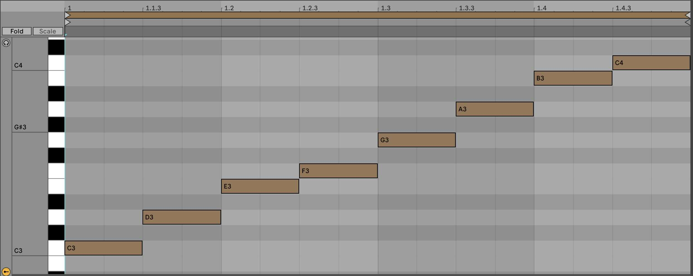
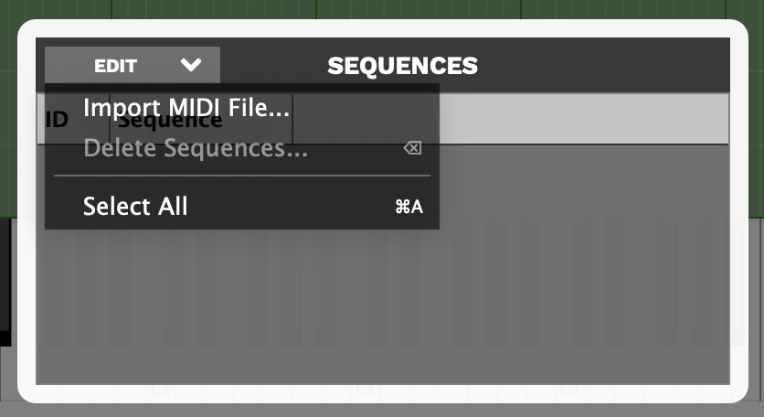

# How to Create Sample Libraries with Note Sequences in DecentSampler

As of version 1.11.1, **DecentSampler** now supports embedding note sequences with your sample libraries. This means that you can create patters or musical motifs that can be triggered either using MIDI or via the UI. This guide will show you how to create a sample library with note sequences and how to trigger them using MIDI.

## Creating a sequence by hand

In this part of the guide, we will go over how to create a sequence by hand. This is useful if you want to create a sequence that is simple, and if you want the XML for your sequence to continue to be easily edited by hand. The first thing you need to do is add a `<noteSequences>` element to your `<DecentSampler>` file:

## The `<noteSequences>` element

The `<noteSequences>` element is how you specify note sequences that can be used by this playback engine. There should be exactly one `<noteSequences>` element in each `<DecentSampler>` file.

The `<noteSequences>` element can contain one or more `<sequence>` elements:

### The `<sequence>` element

The `<sequence>` element has the following attributes:

- `name` (optional): An optional descriptive name for the sequence. This is only used in the sample editor UI to help you identify the sequence.
- `length` (required): The length of the sequence in beats. This is a floating point number.
- `rate` (optional): The rate at which the sequence is played. This is a floating point number. The default is 1.0.

The `<sequence>` element can contain one or more `<note>` elements:

#### The `<note>` element

The `<note>` element has the following attributes:

- `position` (required): The position of the note in the sequence, in beats. This is a whole number.
- `velocity` (required): The velocity of the note. This is a floating point number between 0 and 1.
- `note` (required): The MIDI note number of the note.
- `length` (required): The length of the note in beats. This is a whole number.

An example sequence might looks like this:

```xml
<noteSequences>
    <sequence name="Maj1Slow" length="16" rate="1">
        <note position="0" velocity="1" note="48" length="16"/>
        <note position="1" velocity="1" note="52" length="15"/>
        <note position="2" velocity="1" note="55" length="14"/>
        <note position="3" velocity="1" note="60" length="13"/>
        <note position="4" velocity="1" note="64" length="12"/>
        <note position="5" velocity="1"  note="67" length="11"/>
        <note position="6" velocity="1"  note="72" length="10"/>
        <note position="7" velocity="1" note="76" length="9"/>
        <note position="8" velocity="1" note="79" length="8"/>
        <note position="9" velocity="1" note="84" length="7"/>
        <note position="10" velocity="1" note="88" length="6"/>
        <note position="11" velocity="1" note="91" length="5"/>
    </sequence>
</noteSequences>
```

## Creating a sequence using the sample editor

Another way to create sequences is via MIDI. While the Decent Sampler preset editor does not have a sequence editor built in, it does allow you to import MIDI files to create sequences. This means that you can use your favorite DAW to create sequences and then import them into Decent Sampler. This list of steps assumes that already have a preset created and that you are just looking to add sequences to it.

1. Create a MIDI sequence in your favorite DAW. Here is a sequence I created in Ableton Live:



2. Export the sequence as a MIDI file. The command for doing this will be different in every DAW. In Ableton Live, you can do this by right-clicking on the MIDI clip and selecting **Export MIDI Clip...**.
3. Load your preset in Decent Sampler
4. Open the preset editor by going to **File > Developer Tools > Preset Editor...**. You can also get there by hitting F12.
5. Once you're in the preset editor, choose the **File > Sequence Manager...** menu item. A little box will pop up. This is the sequence manager. It will be empty at first.
6. Click the **Edit > Import MIDI File** menu option, and select the MIDI file you created in step 2.



You will be presented with a dialog box that will ask you whether you want to quantize your sequence. Once you click OK, Decent Sampler will automatically convert the MIDI file into a sequence and add it to the sequence manager. You can then use the sequence in your preset.

7. Close the sequence manager window and save your preset.

## Triggering sequences using MIDI

In order to set up your preset so that specific notes trigger specific sequences, you'll need to make use of the `<midi>` element in your `<DecentSampler>` file. Underneath the `<midi>` element, you can define any number of `<note>` elements. Each `<note>` element has the following attributes:

- `note` (required): The MIDI note number that will trigger the sequence. This can also be a range of notes, such as `24-35`.
- `enabled` (optional): A boolean value that determines whether the note handler is currently functional. The default is `true`.
- `swallowNotes` (optional): A boolean value that determines whether the note handler should swallow the incoming MIDI note or pass it on to the playback engine. The default is `false`, but most people will want to set this to `true`.

Within your `<note>` element, you can define any number of bindings. The bindings we will be using will look something like this:
    
```xml
<DecentSampler pluginVersion="1" minVersion="1.11.1">
  <midi>
    <!-- We define a listener for the notes 24 through 35... -->
    <note note="24-35" enabled="true" swallowNotes="true">
      <binding enabled="true" level="instrument" type="note_sequence" seqIndex="0" seqLoopMode="forward" seqTriggerBehavior="midi_key" seqTransposeWithRootNote="12" seqTrackMidiInputVelocity="1.0" seqPlaybackRate="1"/>
    </note>
  </midi>
  <noteSequences>
    <sequence name="Maj1Slow" length="4" rate="1">
        <note position="0" velocity="1" note="48" length="1"/>
        <note position="1" velocity="1" note="52" length="1"/>
        <note position="2" velocity="1" note="55" length="1"/>
        <note position="3" velocity="1" note="60" length="1"/>
    </sequence>
  </noteSequences>
</DecentSampler>
```

Here is a description of all of the useful attributes for the `<binding>` element:
- `enabled` (optional): A boolean value that determines whether the binding is currently functional. The default is `true`.
- `level` (required): When triggering note sequences, this should always be `instrument`, as these all live at the `instrument` level.
- `type` (required): The type of binding. When triggering note sequences, this should always be `note_sequence`.
- `seqIndex` (required): The index of the sequence in the sequence manager that you want to trigger. This is a zero-based index.
- `seqLoopMode` (optional): The loop mode of the sequence. This can be `forward`, `reverse`, `random`, or `no_loop`.
- `seqTriggerBehavior` (optional): The trigger behavior of the sequence. this can be `midi_key`, `on`, or `off`. When you are triggering a sequence using a MIDI key, this should always be `midi_key`.
- `seqTransposeWithRootNote` (optional): The amount by which the sequence should be transposed when it is triggered, relative to the incoming note. For example, if you set this to 24, and the MIDI note that triggered it was 28, the sequence would be transposed up by 4 semitones, since 28 - 24 = 4.
- `seqTrackMidiInputVelocity` (optional): A floating point value between 0 and 1 that determines whether the sequence should track the velocity of the incoming MIDI note. The default is `1.0`.
- `seqPlaybackRate` (optional): A floating point value that determines the rate at which the sequence should be played. The default is `1.0`.

You can download the example file [here](https://github.com/DecentSamples/DecentSampler-Sample-Library-Examples/releases/) and try it out for yourself. You will want to look in the `example-006-working-with-note-sequences/Example 6A - Triggering Sequences Using MIDI.dspreset` file.

## Triggering note sequences using the UI

In order to trigger note sequences using the UI, you will need to make use of the `<ui>`, `<tab>`, and various UI controls elements in your `<DecentSampler>` file. This tutorial assumes you already have something like this set up. If you don't, you can refer to the [&lt;ui&gt; element section](the-ui-element) for more information.


```xml
<DecentSampler pluginVersion="1" minVersion="1.11.1">
  <ui>
    <tab>
      <!-- This button has two states -->
      <button x="200" y="17" width="100" height="30" style="text" parameterName="Sequencer Enabled" value="0" defaultValue="0">
        <!-- In the Off state, we silence any sequence that might be playing that has the identifier "sequence_button_1"  -->
        <state name="Off">
          <binding level="instrument" type="note_sequence" seqIndex="0" seqTriggerBehavior="off" seqPlayerIdentifier="sequence_button_1"/>
        </state>
        <!-- In the `On` state, we tell the engine to play the sequence "Maj1Slow" (identifier as sequence with index 0). 
        We will specify that it should be tracked internally using the identifier "sequence_button_1". That fact that we are specify this idenfitier 
        now will allow us to turn the sequence off later. -->
        <state name="On">
          <binding level="instrument" type="note_sequence" seqIndex="0" seqLoopMode="forward" seqTriggerBehavior="on" seqTrackMidiInputVelocity="1.0" seqPlaybackRate="1" seqTranspose="12" seqPlayerIdentifier="sequence_button_1"/>
        </state>
      </button>
    </tab>
  </ui>
  <noteSequences>
    <sequence name="Maj1Slow" length="4" rate="1">
        <note position="0" velocity="1" note="48" length="1"/>
        <note position="1" velocity="1" note="52" length="1"/>
        <note position="2" velocity="1" note="55" length="1"/>
        <note position="3" velocity="1" note="60" length="1"/>
    </sequence>
  </noteSequences>
</DecentSampler>
```

In this example, we have a button that has two states: `Off` and `On`. When the button is in the `Off` state, we silence any sequence that might be playing that has the identifier `sequence_button_1`. When the button is in the `On` state, we tell the engine to play the sequence `Maj1Slow`. We will specify that it should be tracked internally using the identifier `sequence_button_1`. That fact that we are specifying this identifier now will allow us to turn the sequence off later.

You can download the example file [here](https://github.com/DecentSamples/DecentSampler-Sample-Library-Examples/releases/) and try it out for yourself. You will want to look in the `example-006-working-with-note-sequences/Example 6B - Triggering Sequences Using UI.dspreset` file.

## Conclusion

In this guide, we went over how to create note sequences by hand and how to import them from MIDI files. We also went over how to trigger sequences using MIDI and the UI. We hope this guide has been helpful to you.